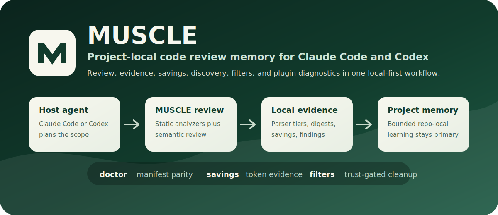

<p align="center">
  
</p>

<h1 align="center">MUSCLE</h1>

<p align="center">
  <strong>MiniMax Unified Self-Correcting Learning Engine</strong>
</p>

<p align="center">
  A self-learning code review and developer-ops plugin for Claude Code, Codex,
  and terminal workflows.
</p>

<p align="center">
  <a href="https://github.com/LivingEthos/muscle"></a>
  
  
  
  
</p>

---

## The Short Version

MUSCLE gives your AI coding setup a second brain for code quality.

Instead of asking an assistant to review the same project from scratch every
time, MUSCLE runs targeted reviews, records evidence, learns which problems
matter in this repo, and exposes that memory through simple CLI commands and
Claude/Codex plugin workflows.

It is built for developers who want:

- better code reviews from AI agents
- local project memory that does not leak into every other repo
- review findings backed by static analyzers and command evidence
- plugin diagnostics that explain whether installation, hooks, docs, and assets
  are healthy
- token/cost visibility instead of mystery model spend
- safe discovery and filters that are opt-in, inspectable, and trust-gated

The core rule is simple:

> **The current project is always the source of truth.**
> Related-project lessons, model packs, and filters are helpers, not hidden
> global policy.

## Why MUSCLE Is Special

Most AI review tools are one-shot: send code, get comments, forget everything.
MUSCLE is different because it treats review as a learning loop.

| MUSCLE feature | Why it matters |
|---|---|
| **Project-local memory** | MUSCLE remembers validated lessons for this repo without turning another project's quirks into your defaults. |
| **Static analysis plus semantic review** | It combines local tools with model review, so obvious lint/test failures and deeper design risks can show up together. |
| **Claude/Codex plugin workflows** | Run review, pressure review, rescue investigations, diagnostics, savings, discovery, and setup checks from your agent UI. |
| **Command evidence artifacts** | Analyzer/test commands keep exit state, parser tier, compact output, digests, and recovery hints instead of dumping noisy logs into context. |
| **Parser tiers** | MUSCLE marks whether a tool result was fully parsed, partially recovered, or passed through, so degraded evidence is visible. |
| **Savings reports** | See token, cache, prompt-compaction, and command-output compaction evidence with `muscle savings`. |
| **Plugin doctor** | `muscle doctor` checks manifests, hooks, command docs, assets, runtime state, model identity, and local setup warnings. |
| **Read-only discovery** | `muscle discover` finds missed review/check opportunities from imported host sessions without editing memory. |
| **Trust-gated filters** | Project-local output filters require explicit trust by digest and inline test coverage before they affect output. |
| **Model identity and packs** | MUSCLE can track the requested model label, resolved canonical model, and optional model-pack overlays. |
| **Release gates and benchmarks** | Long evaluation commands compare strategies and can enforce gates before a risky workflow is promoted. |

## What You Can Do With It

### Review Code

Use MUSCLE as the review engine behind your AI coding session.

```bash
muscle review --target ./src --mode review
```

Useful variants:

```bash
muscle review --target ./src --mode pressure
muscle review --target ./src --mode auto-fix
muscle review --target ./src --mode hybrid --execution worktree
muscle review --target ./src --format json
```

What this gives you:

- severity-ranked findings
- static analyzer results where available
- semantic review from the configured model endpoint
- optional auto-fix or worktree-isolated fix flows
- machine-readable JSON for scripts and CI-style wrappers
- learning signals that can improve future project-local guidance

### Run A Fast Check

If you only want compiler/linter/test validation, run:

```bash
muscle check --target .
```

This is useful before a full review or after a fix.

### Generate And Iterate

MUSCLE is also an iterative generation loop. It can generate code, evaluate it,
evolve the strategy, and repeat until it passes or reaches the configured stop
condition.

```bash
muscle run --task "Build a small FastAPI service with tests" --language python --output ./out
```

Use this when you want a contained implementation attempt with validation and
session history instead of a one-off draft.

### Ask For A Pressure Review

Pressure mode challenges assumptions and looks for failure modes.

```bash
muscle review --target . --mode pressure --focus failure,reliability
```

Use it when a change touches auth, data handling, concurrency, migrations,
billing, safety boundaries, or anything that needs adversarial review.

### Throw A Lifeline

When you have a bug, confusing failure, or suspicious behavior, use lifeline:

```bash
muscle lifeline --target . --prompt "Find why this test only fails in CI"
```

MUSCLE can also attach targeted git history forensics:

```bash
muscle lifeline --target ./src --prompt "Find the regression" --history
```

### Inspect Plugin Health

Run doctor any time setup feels wrong.

```bash
muscle doctor
muscle doctor --refresh
muscle doctor --json
```

Doctor reports:

- whether the project is initialized and enabled
- selected platform and CLI path
- API key presence without printing secrets
- Claude manifest and marketplace manifest status
- Codex manifest and hook status
- manifest and hook digests
- command-doc parity
- plugin assets
- hook runtime degradation state
- active-review snapshot freshness
- model identity
- external importer availability

### See Savings And Evidence

MUSCLE tracks evidence about what it compacted and what it saved.

```bash
muscle savings
muscle savings --json
```

Savings can include:

- LLM token totals by stage
- prompt compaction estimates
- cache impact
- command-output compaction estimates
- parser-tier counts
- high-cost stages

### Discover Missed Opportunities

Discovery looks for places MUSCLE could have helped, without changing memory.

```bash
muscle discover
muscle discover --since 14
muscle discover --json
```

Use it to find repeated failed test/lint loops, edits that should have been
reviewed, or host sessions where MUSCLE evidence would have been useful.

### Trust Output Filters Deliberately

Filters are for boring command-output cleanup. They are not allowed to silently
hide failures.

```bash
muscle filters verify
muscle filters verify --require-all
muscle filters trust
muscle filters untrust
```

Project filters are only used after explicit digest-based trust.

### Route Work To The Right Model

MUSCLE can classify a task before you spend expensive host-model context.

```bash
muscle route --task "Add validation tests for the settings parser" --json
```

The router distinguishes:

- mechanical tasks that M2.7 can handle directly
- reasoning tasks that may need M2.7 plus verification
- architectural tasks that should stay with the host model

### Build Reusable Context Packs

Context packs help repeated subtasks reuse the same distilled scope.

```bash
muscle pack --task "Review auth for input validation" --scope src/auth/
muscle pack list
muscle pack gc --older-than 30d
```

Identical packs produce stable IDs, which lets downstream review/rescue flows
reuse cached context.

### Use The Terminal Dashboard

If you prefer an interactive view, start the TUI:

```bash
muscle tui
```

The dashboard surfaces review history, project memory, fixes, skills, agents,
settings, backups, audit activity, optimization data, and notes.

### Keep An Audit Trail And Backups

MUSCLE includes local operational tooling for safer iteration:

```bash
muscle history
muscle backups list
muscle audit list
muscle notes add -c architecture -t "Why we changed retry behavior" -m "..."
```

Use these when you want review sessions, memory publication, backups, and
project decisions to be inspectable later.

### Work With Project Memory

MUSCLE can suggest related projects, but it does not auto-import their lessons.

```bash
muscle memory related
muscle memory related --refresh --prune-stale
muscle memory import-project --project /path/to/other/project --mode snapshot
muscle memory history
```

Imported lessons stay provisional until current-project validation or explicit
promotion.

### Manage Model Identity And Packs

When a provider label is ambiguous, select the canonical model yourself.

```bash
muscle model status
muscle model history
muscle model select --canonical-model minimax/m2.7@1
muscle model packs install --canonical-model minimax/m2.7@1
```

Model packs are optional overlays. Project-local memory remains primary.

### Run Benchmarks And Release Gates

Use long-eval when you want evidence before promoting a review strategy.

```bash
muscle long-eval reports
muscle long-eval benchmark --enforce-gates
```

The benchmark path compares recall, false positives, token cost, duration, and
release-gate evidence.

## Beginner Install Guide

### Before You Start

You need:

- macOS, Linux, or another shell environment with `bash`
- Git
- Python 3.10 or newer
- a MiniMax token-plan API key for MUSCLE's model calls
- Claude Code if you want slash commands inside Claude Code

Claude subscription access and a MUSCLE API key are different things. Claude
Code can host the plugin UI, but MUSCLE still needs an API key for its own model
review calls.

### 1. Install MUSCLE

```bash
curl -fsSL https://raw.githubusercontent.com/LivingEthos/muscle/main/install.sh | bash
```

The installer checks Python, installs or uses `uv` when available, clones MUSCLE
to `~/.muscle/src`, installs the CLI, and prints plugin setup instructions.

### 2. Add Your API Key

Add these to your shell profile or export them in the terminal before running
MUSCLE:

```bash
export MINIMAX_API_KEY="your-token-plan-api-key"
export ANTHROPIC_BASE_URL="https://api.minimax.io/anthropic"
```

China endpoint:

```bash
export ANTHROPIC_BASE_URL="https://api.minimaxi.com/anthropic"
```

MUSCLE checks whether a key is present, but commands and diagnostics should not
print the secret value.

### 3. Initialize Your Project

From the root of the repo you want MUSCLE to help with:

```bash
muscle init --non-interactive --related-mode suggest --pack-mode suggest
muscle status
muscle doctor
```

This creates `.muscle/` project state and keeps optional overlays in suggest
mode.

### 4. Run Your First Review

```bash
muscle review --target . --mode review
```

For a smaller first run, target one directory:

```bash
muscle review --target ./src --mode review
```

For JSON automation:

```bash
muscle review --target ./src --mode review --format json
```

### 5. Install The Claude Code Plugin

Inside Claude Code:

```text
/plugin marketplace add LivingEthos/muscle
/plugin install muscle@muscle-marketplace
```

Then try:

```text
/muscle:doctor
/muscle:review
/muscle:pressure
/muscle:savings
```

### 6. Local Plugin Development

If you are developing from a checkout instead of installing from the
marketplace:

```bash
git clone https://github.com/LivingEthos/muscle.git
cd muscle
uv sync --extra dev
claude --plugin-dir ./tools/muscle/plugin
```

## Claude Code Slash Commands

These commands are the most common plugin entrypoints:

| Slash command | What it does |
|---|---|
| `/muscle:setup` | Initialize, enable, disable, or inspect MUSCLE setup. |
| `/muscle:review` | Run standard self-learning code review. |
| `/muscle:pressure` | Run adversarial review focused on failure modes and design risk. |
| `/muscle:rescue` | Delegate a deep investigation through `muscle lifeline`. |
| `/muscle:check` | Run compiler/linter/test checks without full semantic review. |
| `/muscle:doctor` | Diagnose plugin lifecycle, manifests, hooks, assets, and active-review state. |
| `/muscle:savings` | Show token, cache, parser, and command-output savings evidence. |
| `/muscle:discover` | Report missed review/check opportunities without writing memory. |
| `/muscle:filters` | Verify, trust, or untrust command-output filters. |
| `/muscle:route` | Classify whether a task should run on M2.7, M2.7 plus verification, or the host model. |
| `/muscle:pack` | Build a reusable context pack for repeated subtasks. |
| `/muscle:probe` | Check background shadow review jobs. |
| `/muscle:diagnosis` | Read completed shadow job results. |
| `/muscle:status` | Show project status and optional active-review refresh. |

Model and memory commands:

| Slash command | What it does |
|---|---|
| `/muscle:memory-related` | Suggest related MUSCLE projects without importing anything automatically. |
| `/muscle:memory-import-project` | Import or attach provisional lessons from another MUSCLE project. |
| `/muscle:memory-history` | Show recent lesson usage and validation history. |
| `/muscle:model-status` | Show current resolved model identity and pack overlays. |
| `/muscle:model-history` | Show recent model identity decisions. |
| `/muscle:model-select` | Manually set or clear the canonical model. |
| `/muscle:model-pack-install` | Install or update optional model-pack overlays. |
| `/muscle:model-pack-submit` | Export and submit a reviewed model-pack candidate as a draft PR. |

Evaluation and maintenance commands:

| Slash command | What it does |
|---|---|
| `/muscle:long-eval-reports` | List recent long evaluation reports. |
| `/muscle:long-eval-benchmark` | Compare review strategies and enforce release gates. |
| `/muscle:optimize-host-docs` | Non-destructively optimize root `CLAUDE.md` and `AGENTS.md` guidance. |
| `/muscle:settings-show` | Show current MUSCLE configuration. |
| `/muscle:settings-review` | Switch review execution between local and isolated worktree modes. |
| `/muscle:settings-model` | Configure related-project and model-pack policies. |
| `/muscle:settings-api-key` | Inspect or configure API key source. |
| `/muscle:kb-stats` | Show knowledge-base statistics. |

Compatibility wrappers:

| Slash command | Current behavior |
|---|---|
| `/muscle:cancel` | Explains how to stop foreground sessions with `muscle abort` and inspect shadow jobs. |
| `/muscle:result` | Alias for `/muscle:diagnosis`; both invoke `muscle diagnosis` for completed shadow job results. |
| `/muscle:rescue` | Alias for `/muscle:lifeline` wired to the `rescue_agent` subagent for directed root-cause investigations. |

## CLI Command Map

MUSCLE can be used without any plugin UI. The CLI is the source of truth for
automation, local scripts, and CI-style wrappers.

| Area | Commands |
|---|---|
| Setup and lifecycle | `init`, `enable`, `disable`, `status`, `settings`, `uninstall`, `doctor` |
| Review and validation | `review`, `check`, `pressure` via `review --mode pressure`, `lifeline`, `probe`, `diagnosis` |
| Iterative generation | `run`, `history`, `resume`, `abort` |
| Evidence and savings | `savings`, `discover`, `filters`, `cache`, `cost`, `optimize` |
| Memory and learning | `memory`, `kb`, `improve`, `skills`, `agents`, `notes`, `optimize-host-docs` |
| Model and routing | `model`, `route`, `pack` |
| Evaluation and release gates | `long-eval`, `escalation` |
| Operations | `backups`, `audit`, `tui` |

For the full command tree:

```bash
muscle --help
muscle <command> --help
```

## Codex Plugin Bundle

MUSCLE ships a Codex plugin manifest and root hook file in the same bundle as
the Claude plugin:

```text
tools/muscle/plugin/.codex-plugin/plugin.json
tools/muscle/plugin/hooks.json
```

The bundle reuses the same commands, skills, assets, and lifecycle diagnostics.
If your Codex build has a plugin validator, validate those files directly. If
your Codex CLI only exposes marketplace management, treat validation as skipped
and use `muscle doctor --json` for local manifest, hook, asset, and command-doc
parity evidence.

## What Gets Stored

Per-project state lives in `.muscle/`:

```text
.muscle/
├── config.yaml
├── project_memory.db
├── active-review.md
├── CLAUDE.md
├── AGENT.md
├── MEMORY.md
├── skills/
├── agents/
├── sessions/
├── reports/
│   └── release_evidence/
├── knowledge/
│   └── strategies.db
└── review_kb/
    └── review_kb.db
```

Shared state lives in `~/.muscle/`:

```text
~/.muscle/
├── system.db
├── model-pack-cache/
├── shadow_jobs.json
├── cache/
│   └── cache.db
└── prompts/
```

Generated `.muscle/active-review.md` files are convenience snapshots. The
authoritative state remains in the project database and bounded memory files.

## Safety And Privacy

MUSCLE is designed to be explicit and inspectable:

- API keys come from environment variables or local settings and should never be
  committed.
- Project memory stays in the project unless you explicitly import, export, or
  submit a model-pack candidate.
- Related-project lessons and model packs are overlays, not global defaults.
- Discovery is read-only by default.
- Project-local filters require digest trust before they are used.
- Doctor is observational unless you ask it to refresh local snapshots.
- JSON output modes are intended for automation and avoid human progress text on
  stdout.

Read more:

- [Privacy notes](docs/PRIVACY.md)
- [Security policy](SECURITY.md)
- [Terms](docs/TERMS.md)

## Developer Commands

```bash
uv sync --extra dev
uv run mypy tools/muscle/
uv run ruff check tools/muscle/
uv run ruff format --check tools/muscle/
uv run pytest tests/ -v
```

Build and inspect a package:

```bash
uv build --out-dir /tmp/muscle-dist
python -m zipfile -l /tmp/muscle-dist/*.whl | rg 'plugin|savings|discover|filters'
```

## Release Evidence

The current plugin-readiness pass validates:

- Claude plugin manifest and marketplace metadata
- Codex manifest, root hooks, and shared assets
- command-doc parity across plugin commands
- `muscle review --format json` as parseable JSON from the first stdout byte
- `muscle savings --json`, `muscle discover --json`, and `muscle filters verify --json`
- full type, lint, format, package, and test gates

See [release notes: plugin readiness and evidence surfaces](docs/release-notes-2026-05-01-plugin-readiness.md).

## License

MUSCLE is released under the [MIT License](LICENSE).
