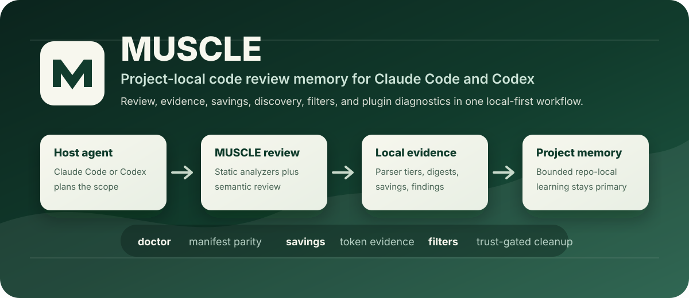

<p align="center">
  
</p>

<h1 align="center">MUSCLE</h1>

<p align="center">
  <strong>MiniMax Unified Self-Correcting Learning Engine</strong>
</p>

<p align="center">
  A self-learning code-review engine and dynamic harness for Claude Code,<br>
  Codex, and any terminal AI coding workflow.
</p>

<p align="center">
  <a href="https://github.com/LivingEthos/muscle"></a>
  
  
  
  
  
</p>

---

## TL;DR

> MUSCLE gives your AI coding agent a **second brain for code quality** —
> one that remembers what matters in *this* project, and a **dynamic harness**
> that wraps your existing workflow with review hooks, isolated fix worktrees,
> background investigations, model routing, and verifiable evidence.

It works with **Claude Code** (as a first-class plugin), **Codex** (via the
shipped bundle), and from the **terminal** as a standalone CLI.

```bash
# install, point at MiniMax, run your first self-learning review
curl -fsSL https://raw.githubusercontent.com/LivingEthos/muscle/main/install.sh | bash
export MINIMAX_API_KEY="your-token-plan-key"
muscle init && muscle review --target . --mode review
```

---

## Why MUSCLE?

Most AI review tools are one-shot: send code, get comments, forget everything.
MUSCLE treats review as a **learning loop** — and it bolts onto whatever AI
coding agent you already use.

| You want… | MUSCLE gives you… |
|---|---|
| **Reviews that get smarter over time** | A project-local memory that learns *your* repo's patterns and never leaks across projects. |
| **Confidence that fixes are real** | Static analysis + semantic review + a verification agent + isolated worktree fixes. |
| **A safer AI agent loop** | Hooks that run on session start, prompt submit, and stop — keeping the host model's memory aligned with project reality. |
| **Less wasted host-model spend** | Routing classifier delegates bulk work to the cheaper M3 model. Your premium host model handles planning. |
| **Auditable evidence** | Every finding, fix, decision, and skill promotion is recorded in a local SQLite DB you can inspect. |
| **Works without lock-in** | The CLI does everything. Plugins are optional sugar on top. |

---

## How it works

MUSCLE is built around two ideas working together.

### 1. The self-learning loop

```
        ┌──────────────────────────────────────────────────────┐
        │  muscle review                                       │
        │                                                      │
        │   static analysis  ─►  semantic review (M3)        │
        │          │                     │                     │
        │          ▼                     ▼                     │
        │      findings + suggested fixes + evidence           │
        │                       │                              │
        │                       ▼                              │
        │              learning pipeline                       │
        │     ┌─────────────────┴────────────────┐             │
        │     │                                  │             │
        │     ▼                                  ▼             │
        │  project_memory.db          host CLAUDE.md /         │
        │  (rules, decisions,         AGENTS.md (published     │
        │   patterns, skills,         dynamic + pinned         │
        │   agents, audit trail)      guidance)                │
        └──────────────────────────────────────────────────────┘
                       │
                       ▼ next review starts already smarter
```

Every review feeds **`project_memory.db`** — the single source of truth for
learned rules, recurring patterns, fix outcomes, and decision provenance. As
patterns repeat, MUSCLE promotes them into project-specific **skills** and
**agents**, and publishes a bounded summary into your root `CLAUDE.md` and
`AGENTS.md` so the *host* coding agent (Opus 4.7, Codex, etc.) starts every
new session aware of the project's hard-won lessons.

### 2. The dynamic harness

MUSCLE doesn't replace your AI coding agent — it wraps one around it.

```
                    ┌─────────────────────────────────────┐
       you ────►    │  Claude Code / Codex (host model)   │
                    └─────────────────────────────────────┘
                       │            ▲             │
              hooks    │            │ refreshed   │ delegates
              fire on  ▼            │ guidance    ▼ bulk work
                    ┌─────────────────────────────────────┐
                    │           MUSCLE harness            │
                    │                                     │
                    │  • SessionStart / Prompt / Stop     │
                    │  • Worktree isolation for fixes     │
                    │  • Shadow background reviews        │
                    │  • Verification agent               │
                    │  • Model routing (M3 vs host)     │
                    │  • Trust-gated output filters       │
                    │  • Token & cost evidence            │
                    └─────────────────────────────────────┘
```

The harness is **opt-in by command**, **inspectable by default**, and
**never silently changes** what your host model sees.

---

## Quick start (5 minutes)

### Prerequisites

- macOS or Linux (or any shell with `bash`)
- Python 3.10+ and `git`
- A **MiniMax** API key ([api.minimax.io](https://api.minimax.io/) — token plan)
- *Optional:* [Claude Code](https://claude.ai/code) for the first-class plugin UI

> **Note:** Your Claude/Codex subscription and your MiniMax key are different
> things. The host agent UI is one tool; MUSCLE uses MiniMax M3 for its own
> review and learning calls because it's roughly **5–10× cheaper per token**
> than premium host models.

### 1. Install

```bash
curl -fsSL https://raw.githubusercontent.com/LivingEthos/muscle/main/install.sh | bash
```

The installer checks Python, uses `uv` when available, clones MUSCLE to
`~/.muscle/src`, and installs the `muscle` CLI.

### 2. Add your API key

```bash
export MINIMAX_API_KEY="your-token-plan-api-key"
# Optional explicit Anthropic-compatible endpoint override:
# export ANTHROPIC_BASE_URL="https://api.minimax.io/anthropic"
# China Anthropic-compatible endpoint:
# export ANTHROPIC_BASE_URL="https://api.minimaxi.com/anthropic"
```

`MINIMAX_API_KEY` (or its legacy alias `ANTHROPIC_API_KEY`) authenticates
MiniMax. By default MUSCLE uses MiniMax's OpenAI-compatible
`https://api.minimax.io/v1` endpoint; set `ANTHROPIC_BASE_URL` only when you
need an explicit Anthropic-compatible endpoint override.

### 3. Initialize your project

```bash
cd /path/to/your/repo
muscle init --non-interactive --related-mode suggest --pack-mode suggest
muscle status
muscle doctor                 # confirm health
```

This creates `.muscle/` with project-local state and writes nothing global.

### 4. Run your first self-learning review

```bash
muscle review --target . --mode review                    # full project
muscle review --target ./src --mode review --format json  # for CI / scripts
muscle review --target ./src --mode review --no-db         # no learning writes
```

You'll get severity-ranked findings, optional auto-fix flows, and the first
entries in your project's learning database.

### 5. Install the Claude Code plugin (optional)

Inside Claude Code:

```text
/plugin marketplace add LivingEthos/muscle
/plugin install muscle@muscle-marketplace
```

Then try:

```text
/muscle:doctor       — verify everything is wired
/muscle:review       — run a self-learning review
/muscle:pressure     — adversarial pressure test
/muscle:rescue       — directed bug investigation
/muscle:savings      — see what was saved on tokens
```

---

## Core workflows

### Review code

The everyday command. Combines local analyzers + M3 semantic review +
learning capture.

```bash
muscle review --target ./src --mode review                 # report only
muscle review --target ./src --mode auto-fix               # apply safe fixes
muscle review --target ./src --mode hybrid                 # fix easy, plan hard
muscle review --target ./src --mode hybrid --execution worktree  # isolated
muscle review --target ./src --mode pressure --intensity intensive
muscle review --target ./src --mode review --format json   # machine-readable
muscle review --target ./src --format json --output review.json
muscle review --target ./src --mode review --no-db         # skip memory/learning writes
muscle review --target ./src --shadow                      # background, async
```

| Mode | What it does |
|---|---|
| `review` | Report findings ranked by severity. Default. |
| `auto-fix` | Apply suggested fixes for low-risk issues. Backups kept. |
| `plan` | Produce a markdown handoff plan instead of editing files. |
| `hybrid` | Auto-fix the easy stuff, plan the rest. |
| `pressure` | Adversarial review focused on failure modes, design risk, edge cases. |

### Quick check (no semantic review)

Run only compiler / linter / test evaluators — fast, deterministic, free.

```bash
muscle check --target .
```

Good for "is this commit-ready?" gates and for warming up before a full review.

### Investigate a bug (lifeline / rescue)

When you have a confusing failure or "only fails in CI" mystery, delegate the
investigation to MUSCLE's rescue agent.

```bash
muscle lifeline --target . --prompt "Find why this test only fails in CI"
muscle lifeline --target ./src --prompt "Find the regression" --history
```

`/muscle:rescue` is the slash-command equivalent and routes through the
`rescue_agent` subagent shipped in the plugin bundle.

### Generate code iteratively

The other half of MUSCLE: a generate → evaluate → evolve loop with full
session history.

```bash
muscle run --task "Build a small FastAPI service with tests" \
           --language python --output ./out
muscle history          # list past sessions
muscle resume <id>      # pick up where a paused session left off
muscle abort <id>       # stop a running session
```

Each iteration is recorded under `.muscle/sessions/<session_id>/` —
`meta.json`, `iterations.jsonl`, `report.json`, and any artifacts.

---

## The dynamic harness

These are the features that wrap MUSCLE around your existing AI coding loop.

### Hooks — keep the host model aligned

When you install the plugin, MUSCLE registers three Claude Code hooks:

| Hook | What it does |
|---|---|
| `SessionStart` | Refreshes `.muscle/active-review.md` with latest project state. |
| `UserPromptSubmit` | Logs the event and updates the active-review snapshot. |
| `Stop` | Triggers learning capture and any pending consolidation. |

All three call `muscle _host-hook` and are graceful no-ops on projects that
haven't been initialized. The host CLI's memory file (`CLAUDE.md` for Claude
Code, `AGENTS.md` for Codex / cross-tool) stays in sync with current
project-memory state.

### Worktree isolation for fixes

```bash
muscle review --target . --mode auto-fix --execution worktree
muscle settings review --execution worktree   # make it the default
```

`worktree` mode runs every fix in an isolated `git worktree`, so a bad fix
can't dirty your working tree.

### Shadow (background) reviews

Long reviews can run async without blocking your terminal:

```bash
muscle review --target . --mode review --shadow   # queue
muscle probe                                       # check status
muscle diagnosis                                   # read completed results
```

### Verification agent

The plugin ships a verification subagent (`verification_agent.md`) that
follows the **apply → validate → record only-if-passing** pattern, so MUSCLE
never learns from a fix that didn't actually work.

### Model routing

Before you spend expensive host-model context on a mechanical task, ask the
router where the work belongs.

```bash
muscle route --task "Add validation tests for the settings parser" --json
```

The classifier returns one of three buckets:

- **mechanical** — M3 can execute directly
- **reasoning** — M3 with a verification pass
- **architectural** — keep with the host model (Opus / Codex)

### Reusable context packs

Repeated subtasks reuse distilled scope, with stable IDs based on content.

```bash
muscle pack --task "Review auth for input validation" --scope src/auth/
muscle pack list
muscle pack gc --older-than 30d
```

### Trust-gated output filters

Project-local filters can clean up noisy command output, but they **never run
silently**. They require explicit digest-based trust before they affect what
you (or your host model) see.

```bash
muscle filters verify
muscle filters verify --require-all
muscle filters trust       # opt in by digest
muscle filters untrust
```

### Token & cost evidence

```bash
muscle savings              # human-readable
muscle savings --json       # machine-readable
muscle cost stats
muscle cost delegation-report
```

Tracks token totals by stage, cache impact, prompt and command-output
compaction, and per-stage cost — so model spend is never a mystery.

### Discovery (read-only)

Find places MUSCLE *could* have helped without touching memory.

```bash
muscle discover
muscle discover --since 14
muscle discover --json
```

Useful for spotting repeated failed test/lint loops in imported host sessions.

---

## Self-learning features

These are the features that make MUSCLE actually get better.

### Project memory (the source of truth)

Every project gets a local SQLite database at `.muscle/project_memory.db`.
It's the **authoritative store** for:

- learned rules and validated lessons
- review run history and findings
- fix attempts and outcomes
- recurring-pattern decisions
- generated skills and agents
- transferred-lesson provenance and validation
- model identity history
- backups and audit trail

You can inspect it with any SQLite tool. MUSCLE never reaches into another
project's database without an explicit import command.

### Learning pipeline

After every `muscle review`, the **`LearningPipeline`** runs:

1. Writes findings and run metadata to the DB.
2. Scores each finding through the **memory decision engine**.
3. Promotes high/critical issues into root-CLAUDE.md rules.
4. Validates and ages existing rules — auto-archives the ones that no longer
   appear after a clean window.
5. Detects recurring patterns and generates project-specific **skills**.
6. Generates specialized **agents** for complex multi-step patterns.
7. Publishes a final, bounded snapshot to `CLAUDE.md` and `AGENTS.md`.

Each step is recorded with provenance, so you can always answer "why does
MUSCLE care about this rule?".

### Host-doc publishing

MUSCLE publishes structured guidance into the **host model's** memory files —
`CLAUDE.md` (Claude Code) and `AGENTS.md` (Codex / cross-tool) — inside a
`MUSCLE_PUBLISHED_START` / `MUSCLE_PUBLISHED_END` marker block.

| Section type | Examples | Behavior |
|---|---|---|
| **Pinned** | Methodology, Delegation Protocol, Effort & Tool Guidance | Byte-identical across cycles, exempt from size caps. |
| **Dynamic** | Critical Rules, Frequent Mistakes, Active Agents, Active Skills, Tooling Notes | Sourced from `project_memory.db`, capped per section, consolidated by M3 when caps are exceeded. |

Pre-existing `CLAUDE.md` / `AGENTS.md` content **outside** the markers is
never reordered, rewritten, or deleted.

```bash
muscle optimize-host-docs            # non-destructive cleanup pass
muscle optimize-host-docs --dry-run  # preview only
```

### Cross-project learning (opt-in only)

MUSCLE can suggest related projects, but **it never auto-imports** their
lessons.

```bash
muscle memory related                       # see suggestions
muscle memory related --refresh --prune-stale
muscle memory import-project --project /path/to/other/project --mode snapshot
muscle memory promotion-candidates          # provisional → validated
muscle memory history
```

Imported lessons stay provisional until your current project's reviews
validate them, or you explicitly promote them.

### Model identity & model packs

When a provider returns an ambiguous label, you can lock in a canonical
identity. Model packs are optional canonical-model overlays — never global
defaults.

```bash
muscle model status
muscle model history
muscle model select --canonical-model minimax/m2.7@1
muscle model packs install --pack-id minimax-m27-core
```

### Release gates & benchmarks

```bash
muscle long-eval reports
muscle long-eval benchmark --suite all --enforce-gates
```

The benchmark suite compares review strategies on recall, false-positive
rate, token cost, and duration — and refuses to promote a candidate that
regresses any axis without an offsetting gain.

---

## Plugin slash commands

MUSCLE ships **37 slash commands** for Claude Code (and an equivalent Codex
bundle). Group them by intent:

#### Setup & lifecycle

| Command | Purpose |
|---|---|
| `/muscle:setup` | Initialize, enable, disable, or inspect MUSCLE. |
| `/muscle:status` | Project status + optional active-review refresh. |
| `/muscle:doctor` | Diagnose plugin lifecycle, manifests, hooks, assets, runtime state. |
| `/muscle:history` | List past MUSCLE sessions. |

#### Review & validate

| Command | Purpose |
|---|---|
| `/muscle:review` | Standard self-learning code review. |
| `/muscle:check` | Compiler / linter / test only (no semantic review). |
| `/muscle:pressure` | Adversarial review (`--intensity` from minimal to exhaustive). |
| `/muscle:rescue` | Focused root-cause investigation through the `rescue_agent`. |
| `/muscle:lifeline` | Direct CLI entry to a rescue investigation. |
| `/muscle:foresight` | Explicit offline preflight planning; experimental and opt-in only. |

#### Background & evidence

| Command | Purpose |
|---|---|
| `/muscle:probe` | Check background shadow review job status. |
| `/muscle:diagnosis` | Read completed shadow job results. |
| `/muscle:result` | Alias for `/muscle:diagnosis`. |
| `/muscle:cancel` | How to stop foreground / shadow sessions. |
| `/muscle:savings` | Token, cache, parser, and command-output savings. |
| `/muscle:discover` | Missed review/check opportunities (read-only). |

#### Routing, packs, filters

| Command | Purpose |
|---|---|
| `/muscle:route` | Classify a task: M3, M3 + verification, or host model. |
| `/muscle:pack` | Build a reusable context pack. |
| `/muscle:filters` | Verify, trust, or untrust output filters. |

#### Memory & model identity

| Command | Purpose |
|---|---|
| `/muscle:memory-related` | Suggest related projects (no auto-import). |
| `/muscle:memory-import-project` | Import provisional lessons from another project. |
| `/muscle:memory-history` | Recent lesson usage and validation history. |
| `/muscle:model-status` | Show resolved canonical model and pack overlays. |
| `/muscle:model-history` | Model identity history. |
| `/muscle:model-select` | Set or clear the canonical model manually. |
| `/muscle:model-pack-install` | Install or update model-pack overlays. |
| `/muscle:model-pack-submit` | Export and submit a draft pack PR. |

#### Evaluation & maintenance

| Command | Purpose |
|---|---|
| `/muscle:long-eval-reports` | List recent benchmark / evaluation reports. |
| `/muscle:long-eval-benchmark` | Compare strategies, enforce release gates. |
| `/muscle:optimize-host-docs` | Non-destructive `CLAUDE.md` / `AGENTS.md` cleanup. |
| `/muscle:kb-stats` | Knowledge-base statistics. |
| `/muscle:settings-show` | Current MUSCLE configuration. |
| `/muscle:settings-review` | Switch review execution between local and worktree. |
| `/muscle:settings-model` | Configure related-project / model-pack policies. |
| `/muscle:settings-api-key` | Inspect or configure API key source. |

---

## CLI reference

The CLI is the source of truth — plugin commands are thin wrappers around it.

| Area | Commands |
|---|---|
| **Setup & lifecycle** | `init`, `enable`, `disable`, `status`, `settings`, `uninstall`, `doctor` |
| **Review & validation** | `review`, `check`, `lifeline`, `foresight`, `probe`, `diagnosis` |
| **Iterative generation** | `run`, `history`, `resume`, `abort` |
| **Evidence & savings** | `savings`, `discover`, `filters`, `cache`, `cost`, `optimize` |
| **Memory & learning** | `memory`, `kb`, `improve`, `skills`, `agents`, `notes`, `optimize-host-docs` |
| **Model & routing** | `model`, `route`, `pack` |
| **Evaluation & gates** | `long-eval`, `escalation` |
| **Operations** | `backups`, `audit`, `tui` |

For full details:

```bash
muscle --help
muscle <command> --help
```

### Interactive terminal dashboard

```bash
muscle tui
```

Live views over review history, project memory, fixes, skills, agents,
settings, backups, audit activity, optimization data, and notes.

---

## Codex bundle

The same plugin source ships a Codex manifest and root hook file:

```text
tools/muscle/plugin/.codex-plugin/plugin.json
tools/muscle/plugin/hooks.json
```

The bundle reuses the same commands, skills, assets, and lifecycle
diagnostics as the Claude Code plugin. If your Codex build has a plugin
validator, validate those files directly. If your Codex CLI only exposes
marketplace management, treat validation as skipped and use
`muscle doctor --json` for local manifest, hook, asset, and command-doc
parity evidence.

---

## What gets stored

### Per-project (`.muscle/` in your repo)

```text
.muscle/
├── config.yaml
├── project_memory.db          ← authoritative learning store
├── active-review.md           ← refreshed by hooks
├── CLAUDE.md                  ← internal mirror (not authoritative)
├── AGENT.md
├── MEMORY.md
├── skills/                    ← generated project-specific skills
├── agents/                    ← generated specialist agents
├── sessions/                  ← per-run history + artifacts
├── reports/
│   └── release_evidence/
├── knowledge/strategies.db
└── review_kb/review_kb.db
```

### Shared (`~/.muscle/`)

```text
~/.muscle/
├── system.db                  ← cross-project fingerprints + aliases + packs
├── model-pack-cache/
├── cache/cache.db
└── prompts/
```

The root-of-repo `CLAUDE.md` / `AGENTS.md` files are **published**, not
authoritative — the DB is the truth.

---

## Safety & privacy

MUSCLE is built to be inspectable, opt-in, and incrementally trusted.

- **API keys** come from environment variables or local settings — never committed.
- **Project memory** stays in the project unless you import, export, or submit a model pack.
- **Cross-project lessons and model packs** are overlays, not global defaults.
- **Discovery is read-only** by default.
- **Project-local filters** require digest trust before they're used.
- **Doctor** is observational — it never modifies state unless you pass `--refresh`.
- **Foresight** is explicit-only and offline; it writes only bounded short-term
  state when requested and never promotes learned memory.
- **JSON output** modes avoid human progress text on stdout, so they're safe for piping into automation.
- **Hooks** never block the host CLI — they fail gracefully if MUSCLE isn't initialized.

Read more:

- [Privacy notes](docs/PRIVACY.md)
- [Security policy](SECURITY.md)
- [Terms](docs/TERMS.md)

---

## For developers

### Local plugin development

```bash
git clone https://github.com/LivingEthos/muscle.git
cd muscle
uv sync --extra dev
claude --plugin-dir ./tools/muscle/plugin
```

### Quality gates

All of these must pass before merging:

```bash
uv sync --frozen --extra dev               # reproducible install
uv run mypy tools/muscle/                  # type check
uv run ruff check tools/muscle/            # lint
uv run ruff format --check tools/muscle/   # format
uv run pytest tests/ -v                    # tests
```

### Build & inspect a wheel

```bash
uv build --out-dir /tmp/muscle-dist
python -m zipfile -l /tmp/muscle-dist/*.whl | rg 'plugin|savings|discover|filters'
```

### Architecture deep dive

See [docs/architecture.md](docs/architecture.md) for the runtime map, the two
primary loops, the resolver subsystems, the persistence model, and the
host-memory contract.

---

## Release evidence

The current plugin-readiness pass validates:

- Claude plugin manifest and marketplace metadata
- Codex manifest, root hooks, and shared assets
- Slash-command-doc parity across the bundle
- `muscle review --format json` as parseable JSON from the first stdout byte,
  including `--output` JSON file writes
- `muscle doctor --json`, `muscle savings --json`, `muscle discover --json`,
  `muscle foresight --task "smoke" --no-write --json`,
  `muscle filters verify --json`, and `muscle check --format json` as
  parseable machine JSON
- Full type, lint, format, package, and test gates

See the latest [plugin readiness release notes](docs/release-notes-2026-05-01-plugin-readiness.md).

---

## License

MUSCLE is released under the [MIT License](LICENSE).
