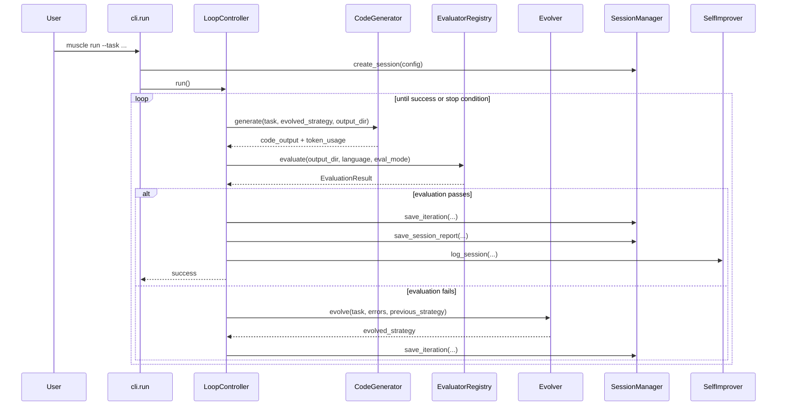
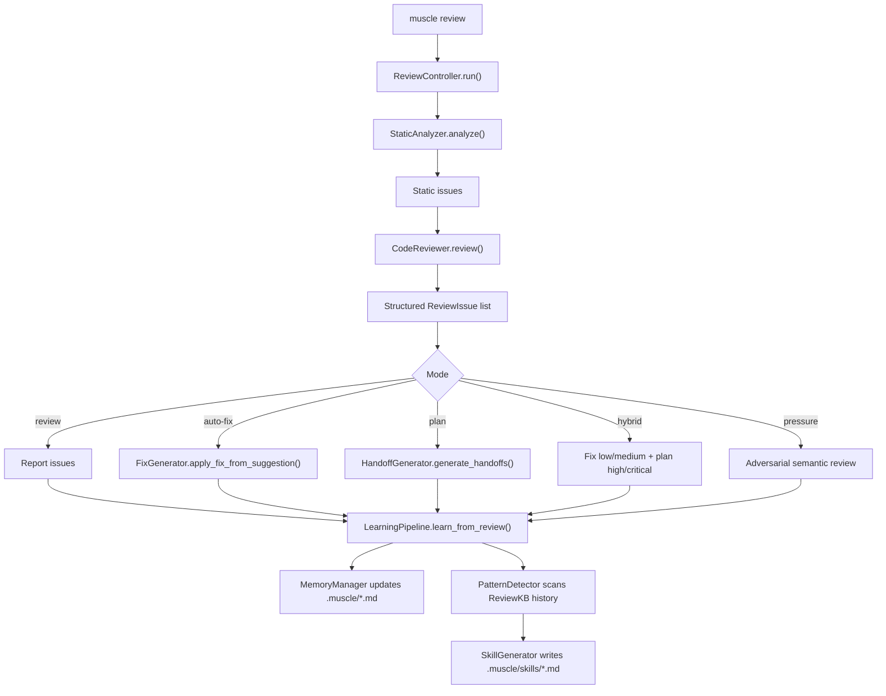

# MUSCLE Architecture and Runtime Guide

Last updated: 2026-04-16

This document explains how the active MUSCLE application works today based on the
implemented `tools/muscle/` package. It is intended to be the source-of-truth
architecture explainer for contributors and users who want to understand the
runtime flow, storage model, and subsystem boundaries.

### Status Legend

Subsystems in this document are annotated with one of:

- ✅ **Implemented** — wired into the CLI and exercised by the default flows
- 🚧 **In progress** — module exists and partially wired, but not every path is
  exercised by default commands (see `MUSCLE_PLAN.md` for active phases)
- 💡 **Planned** — designed or referenced but not yet implemented

When the same subsystem appears under multiple status buckets, that means the
base capability is real today and only the deeper refinements are still in
progress; the subsection text calls out the boundary explicitly.

## What MUSCLE Is

MUSCLE has two primary runtime loops:

1. A generate -> evaluate -> evolve loop exposed by `muscle run`
2. A review -> fix/plan -> learn loop exposed by `muscle review`

Both loops are powered by the MiniMax M2.7 API through an Anthropic-compatible
client and both persist state so the project can compound over time.

MUSCLE is now explicitly project-first:

- the current project's local memory remains authoritative
- related-project lessons are optional provisional overlays
- model-pack lessons are optional canonical-model overlays
- shared global state is stored separately from project-owned state

`tools/muscle/` is the active package tree.

`tools/scle/` is a legacy predecessor that still exists in the repo, but it is
not the package installed by `pyproject.toml` and it is excluded from coverage.

## Top-Level Runtime Map

```mermaid
flowchart TD
    User["User or plugin command"]
    CLI["tools/muscle/cli.py"]
    Init["muscle init"]
    ProjectCtl["status/settings/memory/model"]
    Run["muscle run"]
    Review["muscle review"]
    Check["muscle check"]
    TUI["muscle tui"]
    Bench["long-eval benchmark"]
    Plugin["tools/muscle/plugin"]

    User --> CLI
    Plugin --> CLI

    CLI --> Init
    CLI --> ProjectCtl
    CLI --> Run
    CLI --> Review
    CLI --> Check
    CLI --> TUI
    CLI --> Bench

    ProjectCtl --> PM["ProjectManager"]
    ProjectCtl --> LocalDB["ProjectMemory"]
    ProjectCtl --> SystemDB["SystemDatabase"]
    ProjectCtl --> Resolver["LessonResolver + ModelIdentityResolver"]
    ProjectCtl --> Packs["ModelPackManager"]

    Run --> Loop["LoopController"]
    Loop --> Generator["CodeGenerator"]
    Loop --> Evaluators["EvaluatorRegistry + evaluators/*"]
    Loop --> Evolver["Evolver + StrategyKB"]
    Loop --> Sessions["SessionManager"]
    Loop --> Budget["BudgetManager"]
    Loop --> Git["GitAdapter auto-commit"]
    Loop --> Hooks["WebhookNotifier"]
    Loop --> Improve["SelfImprover"]

    Review --> ReviewController["ReviewController"]
    ReviewController --> Static["StaticAnalyzer"]
    ReviewController --> Semantic["CodeReviewer"]
    ReviewController --> Fixes["FixGenerator"]
    ReviewController --> Handoff["HandoffGenerator"]
    Review --> Learning["LearningPipeline"]
    Learning --> Memory["MemoryManager"]
    Learning --> Patterns["PatternDetector"]
    Learning --> Skills["SkillGenerator"]

    Review --> Shadow["ShadowBroker + ShadowWorker"]
    Review --> LongEval["LongEvalRunner"]
```



## Primary Entry Points

### `muscle init` ✅

`muscle init` uses `tui/project_manager.py` to detect the current project and
create the local `.muscle/` workspace. It writes the initial project config,
creates the memory files that MUSCLE later updates, registers the project
fingerprint, and can capture the initial related-project and model-pack policy.

What it creates immediately:

- `.muscle/config.yaml`
- `.muscle/project_memory.db`
- `.muscle/strategy_kb.json`
- `.muscle/CLAUDE.md`
- `.muscle/AGENT.md`
- `.muscle/MEMORY.md`
- `.muscle/skills/`
- `.muscle/logs/`

Important implementation detail:

- `config.yaml` is currently written with JSON content even though the filename
  ends in `.yaml`
- setup can now persist related-project suggestion mode, model-pack mode, and a
  manual canonical-model override when provided

### `muscle run` ✅

`muscle run` is the autonomous generation loop. It optionally scaffolds a
project, generates code, evaluates the output, and evolves the next strategy
until success, budget exhaustion, timeout, abort, or max iterations.

### `muscle review` ✅

`muscle review` is the code review workflow. It combines local static analysis,
M2.7 semantic review, optional fix application, and post-review learning.

### `muscle tui` 🚧

`muscle tui` launches the Rich-based terminal UI scaffold in `tools/muscle/tui/`.
It is a real entry point and navigation shell. The `History` view now shows live
review runs, model identity history, and lesson-usage history, and the
knowledge/audit surfaces reflect transferred-lesson provenance. Some screens are
still lighter-weight than the CLI, but the TUI is no longer just a placeholder shell.

### Project-First Control Surfaces ✅

The project-first learning stack is now exposed through first-class commands in
addition to `init`, `run`, and `review`.

- `muscle status` shows project enablement, storage location, counts, and the
  active project context
- `muscle settings show` and `muscle settings model` expose related-project
  mode, model-pack mode, canonical model, and manual override settings
- `muscle memory related`, `import-project`, `linked`, `history`,
  `promotion-candidates`, and related commands manage provisional external lessons
- `muscle model status`, `history`, `select`, and `packs ...` manage resolved
  model identity and model-pack overlays
- `muscle long-eval benchmark --enforce-gates` validates that overlays improve
  behavior without regressing the default project-only path

### Resolver Subsystems ✅

Two small resolver subsystems sit behind the project-first control surfaces and
decide, at call time, *which* model identity and *which* lessons should apply
to the current invocation.

#### `LessonResolver`

`LessonResolver` composes the effective lesson set for a given review or run
in a deterministic priority order:

1. **Project-local lessons** — `project_memory.db` (authoritative)
2. **Related-project provisional overlays** — lessons imported from linked
   projects and still in validation (mode-gated)
3. **Model-pack canonical overlays** — lessons shipped by a registered pack
   and scoped to the resolved canonical model (mode-gated)

Resolution example (settings: related=suggest, pack=apply):

```
request → LessonResolver.resolve(project_id, canonical_model)
       → [local rule: "avoid bare except"]  (authoritative)
       → [related rule: "lock before DB write"]  (suggestion, tagged)
       → [pack rule: "use typed error classes"]  (applied, tagged)
       → MergedLessonSet (dedup by rule_id, project rules win ties)
```

Callers receive a `MergedLessonSet` that preserves per-lesson provenance so
telemetry and the TUI knowledge view can distinguish project-owned vs
provisional vs canonical entries, and `muscle memory promotion-candidates`
can propose validated provisional rules for promotion into the project layer.

#### `ModelIdentityResolver`

`ModelIdentityResolver` maps the raw API model string returned by M2.7 (or
the user-supplied override) to a stable *canonical model identity* that the
rest of MUSCLE uses for pack scoping, memory keying, and history tracking.

Resolution example:

```
api returns: "MiniMax-M2.7-2026-03-preview"
ModelIdentityResolver.resolve(raw="MiniMax-M2.7-2026-03-preview")
  → lookup alias table in system.db
  → canonical = "minimax-m2.7"
  → persist identity event in project_memory.db
```

The resolver exposes:

- `resolve(raw)` — returns `ModelIdentity(canonical, raw, alias_source)`
- `override(canonical)` — force a specific canonical identity for a run
- `history(project_id)` — prior identities observed for the project

Both resolvers are invoked from `muscle status`, `muscle settings model`, and
the run/review entrypoints. They also participate in the
`muscle long-eval benchmark --enforce-gates` overlay validation so we never
accept a pack change that regresses the default project-only path.

## The `muscle run` Flow

### Components Involved

- `cli.py` builds the runtime config and dependencies
- `LoopController` owns iteration state and stop conditions
- `CodeGenerator` calls M2.7 and writes generated files
- `EvaluatorRegistry` selects compiler, test, and lint evaluators by language
- `Evolver` analyzes failures and produces the next strategy
- `SessionManager` persists progress under `.muscle/sessions/`
- `BudgetManager` enforces fixed or auto budgets
- `GitAdapter` optionally creates a branch and commit on success
- `WebhookNotifier` emits lifecycle notifications
- `SelfImprover` logs outcomes for later self-analysis

### Sequence



### What Happens In Each Iteration

1. `LoopController` optionally pauses for interactive approval or user hints.
2. `CodeGenerator` sends the task and the latest evolved strategy to M2.7.
3. The generator parses fenced code blocks and writes files into `output_dir`.
4. `EvaluatorRegistry` picks evaluators based on detected or supplied language.
5. Evaluation failures are flattened into error lists.
6. `Evolver` turns those errors into a new strategy prompt, optionally using
   similar prior strategies from `StrategyKB`.
7. The iteration result is written to `.muscle/sessions/<session_id>/`.

### Stop Conditions

The run loop stops when one of these is true:

- evaluation passes
- `max_iterations` is reached
- timeout is reached
- user abort is requested
- budget is exceeded
- early exit condition is met, such as passing tests

### Evaluation Modes

`RunConfig.eval_mode` controls how failures are fed back into the evolver:

- `all`: one combined error set per iteration
- `sequential`: evolve once per error
- `parallel`: evaluate tools in parallel, then evolve on the combined result

### Git Behavior

If git is enabled, a successful run can:

- create branch `muscle/session-<session_id>`
- stage changed files
- commit with a MUSCLE session summary
- optionally push the branch

This is wired through `LoopController._auto_commit()` and `adapters/git_adapter.py`.

## The `muscle review` Flow

### Components Involved

- `ReviewController` orchestrates the review mode
- `StaticAnalyzer` runs local tools such as Ruff, ESLint, TSC, Clippy, and more
- `CodeReviewer` asks M2.7 to validate and classify findings
- `FixGenerator` applies suggested code replacements for fixable issues
- `HandoffGenerator` produces markdown plans for issues not auto-fixed
- `LearningPipeline` updates memory files and attempts recurring-pattern skill generation

### Sequence



### Review Modes

- `review`: report issues
- `auto-fix`: apply fix suggestions for fixable issues
- `plan`: produce a handoff plan without editing files
- `hybrid`: auto-fix lower-risk issues and generate a plan for harder ones
- `pressure`: adversarial review that challenges design choices and failure modes

### Static Analysis Layer

`StaticAnalyzer` chooses tools by detected language and runs them concurrently.

Examples:

- Python: Ruff, Pyright, Bandit
- JavaScript: ESLint
- TypeScript: ESLint, TSC
- Go: golangci-lint
- Rust: Clippy
- C/C++: cppcheck
- Java: Checkstyle

The output is normalized into `StaticIssue` records before the semantic pass.

### Semantic Review Layer

`CodeReviewer` groups issues by file, reads source content, and asks M2.7 to:

- confirm whether the issue is real
- classify severity and category
- decide whether the issue is auto-fixable
- suggest a concrete fix when possible

If there are no static findings, `CodeReviewer` can still do a proactive file review.

### Fix and Handoff Layer

`FixGenerator` currently applies the suggested replacement directly to the file,
with a temporary backup during the write. `HandoffGenerator` is used when the
selected mode needs a markdown plan for human follow-up.

## Learning and Memory Flow ✅ / 🚧

The review command calls `LearningPipeline.learn_from_review()` after a review
completes.

### What The Learning Pipeline Does Today

1. Categorizes findings by severity
2. Writes immediate high/critical rules into `.muscle/CLAUDE.md` and related memory files
3. Writes tracked findings into `.muscle/MEMORY.md`
4. Validates and ages existing rules
5. Attempts recurring-pattern detection and skill generation
6. Logs the review session summary

### Memory File Boundaries

`MemoryManager` performs marker-based edits so MUSCLE only updates bounded
sections of the managed markdown files.

Current markers used by the implementation:

- `<!-- MUSCLE_LEARNED_START -->` / `<!-- MUSCLE_LEARNED_END -->`
- `<!-- MUSCLE_MEMORY_START -->` / `<!-- MUSCLE_MEMORY_END -->`

### Important Accuracy Note

The memory-update path is actively wired into the CLI today.

The broader recurring-pattern subsystem is present, but parts of it are more
foundational than fully saturated:

- `PatternDetector` reads from `ReviewKB`
- `ReviewKB` APIs exist for storing reviewed issues and fix effectiveness
- the review controller currently records fix attempts directly during auto-fix
- deeper issue-history population and long-horizon strategy evolution are present
  as modules, but not every advanced path is exercised equally by the CLI

That means the learning loop is real today, but its strongest compounding effect
comes from memory-file updates and persisted session history, with the deeper
pattern/skill ecosystem still maturing.

## Shadow Reviews and Long Evaluations

### Shadow Mode ✅

`muscle review --shadow` uses:

- `ShadowBroker` for persistent job bookkeeping in `~/.muscle/shadow_jobs.json`
- `ShadowWorker` for background processing

The worker runs review jobs in-process and updates status for `muscle probe` and
`muscle diagnosis`.

### Long Evaluation Mode ✅

Long evaluation is a manual deep-review workflow:

- `LongEvalRunner` runs one or more review scans and writes reports to `.muscle/reports/`
- Triggered manually via `muscle long-eval run`

Important implementation detail:

- there is no scheduling or automatic overnight execution
- the deep evaluation is always user-triggered and runs immediately

## Persistence Model

### Per-Project State

These files and directories live under the target project:

```text
.muscle/
  config.yaml                 # JSON content written by ProjectManager
  project_memory.db           # Authoritative per-project memory and telemetry DB
  strategy_kb.json            # Initial project bootstrap file
  CLAUDE.md
  AGENT.md
  MEMORY.md
  logs/
  skills/
  agents/                     # Created on demand by AgentGenerator
  knowledge/
    strategies.db             # StrategyKB SQLite database
  review_kb/
    review_kb.db             # ReviewKB SQLite database
  sessions/
    <session_id>/
      meta.json
      iterations.jsonl
      report.json
      context.json
      artifacts/
  reports/
    long_eval_YYYY-MM-DD.json
    long_eval_YYYY-MM-DD.md
    release_evidence/
  budget.json                 # Optional auto-budget state
```

`project_memory.db` is the authoritative per-project store for:

- learned rules and notes
- review/run histories
- lesson usage events
- transferred-lesson validation and promotion state
- model identity history
- backup metadata and optimization telemetry

Older adjacent stores such as `knowledge/strategies.db` and
`review_kb/review_kb.db` still exist, but the project-first learning surfaces
are centered on `project_memory.db`.

### Global State

These files and directories live under the user home directory:

```text
~/.muscle/
  system.db                  # Shared project fingerprints, aliases, packs, submissions
  model-pack-cache/
  cache/cache.db
  shadow_jobs.json
  improvement_log.json
  prompts/
  <session_id>.pid
  global/strategies.db
  global_review/review_kb.db
```

The shared `system.db` is intentionally separate from project-local state. It
stores cross-project metadata that is not owned by a single repo, including:

- registered project fingerprints
- model alias mappings
- installed model packs
- pack submission history

Normal `muscle review` and `muscle run` do not fetch from the network to refresh
these overlays. Remote pack access is restricted to explicit install/update/submit
commands.

## Integrations and Their Maturity

### Fully Wired From The CLI ✅

- MiniMax M2.7 API client
- session persistence and resume
- evaluator selection and execution
- review modes
- shadow job commands
- long evaluation report generation
- git auto-commit for successful run sessions
- webhook notifications for run sessions
- learning pipeline memory updates

### Present As Subsystems Or Partial Surfaces 🚧

- TUI history, knowledge, and audit surfaces now reflect live project state, but
  some settings and management screens are still lighter than the CLI
- GitHub, GitLab, Jenkins, and MCP adapters exist as implementation modules
- `adapters/github_integration.py` provides a higher-level GitHub workflow layer,
  but it is not yet a major first-class CLI command family
- review pattern evolution, generated agents, and broader multi-review compounding
  are implemented as modules and storage layers, but not every path is equally
  surfaced or exercised by default commands

## Why The App Is Structured This Way

The architecture deliberately separates:

- orchestration from model calls
- semantic review from static analysis
- generation from evaluation
- review findings from memory persistence
- project-local authoritative memory from optional overlays and shared caches

That separation keeps the CLI composable, makes subsystems independently testable,
and lets MUSCLE evolve from a simple code-review companion into a broader
self-improving automation loop without collapsing everything into one monolith.

## Host Memory Contract (Plugin → Host CLI)

MUSCLE's plugin publishes structured content to the **host CLI**'s memory files (Claude Code → `CLAUDE.md`, Codex/cross-tool → `AGENTS.md`) at the root of every reviewed project. The publisher (`tools/muscle/claude_publisher.py`) writes identical content to both files inside the `MUSCLE_PUBLISHED_START` / `MUSCLE_PUBLISHED_END` marker region.

### Section types

**Pinned** — always present, byte-identical across consolidation cycles, exempt from the 50-line section cap:
- `### Methodology` — four-principle design guide (think / simplicity / surgical / goal-driven).
- `### Delegation Protocol` — plan-then-hand-off posture directing the host model to delegate bulk execution to MUSCLE's M2.7 agents.
- `### Effort & Tool Guidance` — Opus 4.7 effort hints (`xhigh` for coding) and auto-mode guidance.

All pinned content is sourced from `tools/muscle/code_review/host_memory_templates.py` (constant strings; no dynamic rendering).

**Dynamic** — populated from `project_memory.db` via `LearningPipeline` → `MemoryDecisionEngine` → `ClaudePublisher.publish()`. Subject to the 50-line section cap and M2.7 consolidation when caps are exceeded:
- `### Critical Rules`, `### Frequent Mistakes`, `### Active Agent Calls`, `### Active Skill Calls`, `### Tooling Notes`.

### Optimizer flow

`tools/muscle/code_review/host_memory_optimizer.py` provides a non-destructive rewriter for pre-existing `CLAUDE.md` / `AGENTS.md` files that predate the MUSCLE plugin. Exposed as `muscle optimize-host-docs`. It wraps user content in `MUSCLE_PUBLISHED` markers (if absent) and injects the pinned block. Content outside the markers is never reordered, rewritten, or deleted. Pure and deterministic — no M2.7 calls.

### File map

- `tools/muscle/code_review/host_memory_templates.py` — pinned content constants.
- `tools/muscle/code_review/host_memory_optimizer.py` — non-destructive optimizer.
- `tools/muscle/claude_publisher.py` — marker-bounded dynamic publisher (now multi-target).
