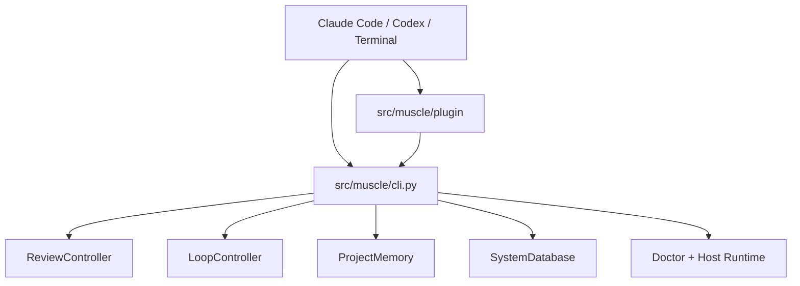

# Architecture

| Field | Value |
|---|---|
| Audience | Maintainers and technical users |
| Status | Current runtime overview |
| Source of truth | [`docs/architecture.md`](../../docs/architecture.md), [`src/muscle/cli.py`](../../src/muscle/cli.py), [`src/muscle/plugin/`](../../src/muscle/plugin/) |

MUSCLE has two main layers:

1. Plugin hosts: Claude Code and Codex bundle files expose commands, hooks,
   skills, agents, and assets.
2. CLI runtime: `src/muscle/cli.py` dispatches all real behavior.

The plugin should be treated as a user interface and lifecycle integration
layer. The CLI and `src/muscle/` modules are the implementation boundary.

## Top-Level Flow



## Primary Runtime Areas

| Area | Entry points | Implementation |
|---|---|---|
| Setup and lifecycle | `init`, `enable`, `disable`, `status`, `doctor`, `settings` | `cli.py`, `tui/project_manager.py`, `doctor.py`, `active_review.py` |
| Review and fix | `review`, `check`, `lifeline`, `probe`, `diagnosis` | `code_review/*`, `evaluators/*`, `m27_client.py` |
| Learning and memory | `memory`, `kb`, `improve`, generated skills/agents | `project_memory.py`, `learning_pipeline.py`, `memory_manager.py` |
| Model and routing | `route`, `model`, `pack` | `routing.py`, `model_identity.py`, `lesson_resolver.py`, `packs.py`, `model_packs.py` |
| Evidence and optimization | `savings`, `discover`, `filters`, `optimize`, `cost` | `command_evidence.py`, `output_filters.py`, `optimization/*`, `savings.py` |
| Host hooks | `_host-hook` | `host_runtime.py`, `active_review.py` |

## Current Package Boundary

- Active implementation: [`src/muscle/`](../../src/muscle/).
- Legacy implementation: `tools/scle/`.
- Installed script: `muscle = "muscle.cli:main"` in
  [`pyproject.toml`](../../pyproject.toml).

Do not use `tools/scle/` to document current plugin behavior unless the task is
explicitly about legacy migration.

## Project-First Design

MUSCLE keeps the current project authoritative:

- `.muscle/project_memory.db` stores local rules, reviews, findings, model
  identity history, transferred lesson lifecycle, telemetry, and audit events.
- Related projects can contribute provisional lessons only when imported or
  attached.
- Model packs are optional canonical-model overlays.
- Global `~/.muscle/system.db` stores shared catalogs, model aliases, packs, and
  registrations, not project-owned truth.

## Host Runtime

Claude and Codex hooks call the hidden CLI command:

```bash
muscle _host-hook --platform <claude-code|codex> --event <event>
```

`host_runtime.py` centralizes hook behavior, refreshes active-review state, and
fails open on degraded hook paths.

